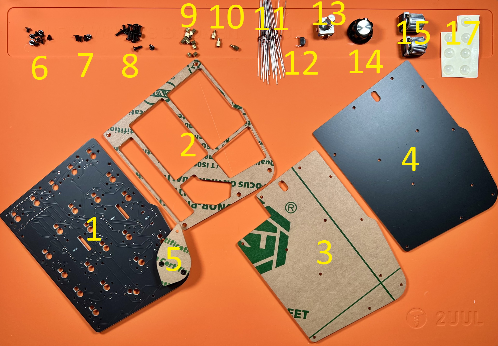
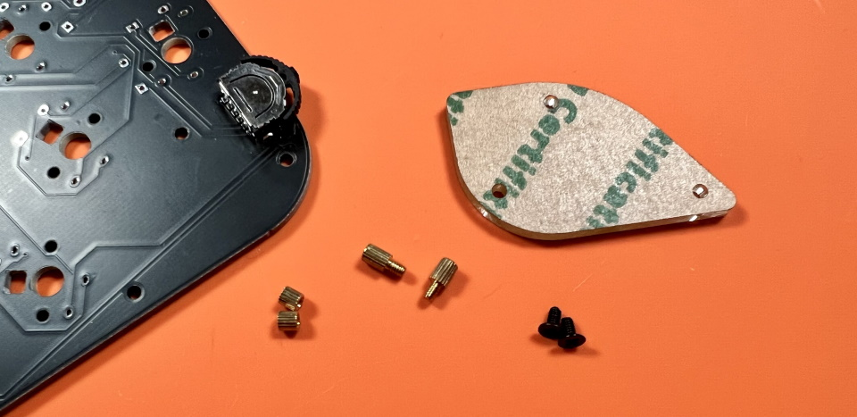
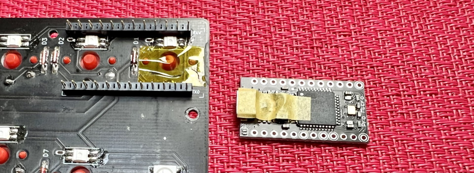
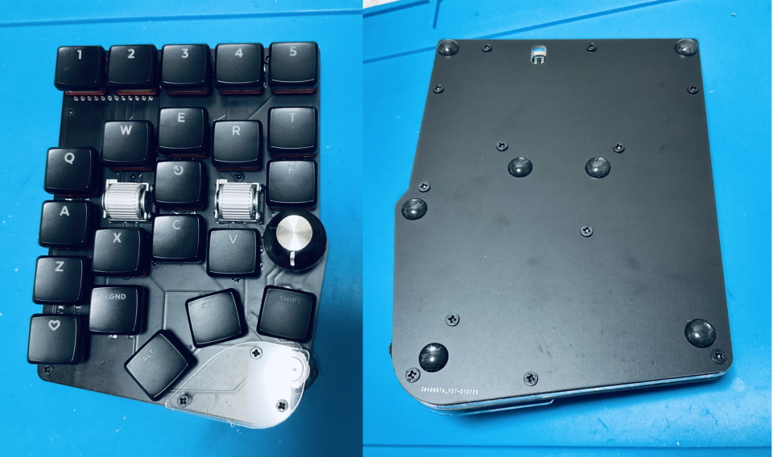

# Handyman マクロパッド ビルドガイド（[English](https://github.com/Taro-Hayashi/Handyman/blob/main/README_EN.md)）
- [キット内容](#キット内容)
- [組み立て方（はんだ付けその1）](#組み立て方はんだ付けその1)
- [動作テスト](#動作テスト)
- [組み立て方（はんだ付けその2）](#組み立て方はんだ付けその2)
- [組み立て方（後半）](#組み立て方後半)
- [カスタマイズ](#キーマップの確認変更方法)
- [おまけ](#おまけ)

はんだ済みをご購入の方は組み立て方（後半）からお読みください。

## キット内容

||部品名|数| |
|-|-|-|-|
|1|メインボード|1|黒・PCB|
|2|ミドルプレート1|1|透明アクリル・穴の開いている方|
|3|ミドルプレート2|1|透明アクリル|
|4|ボトムプレート|1|黒・PCB|
|5|保護プレート|1|透明アクリル・小さい|
|6|ネジ（短）|9|3mm|
|7|ネジ（中）|3|4mm|
|8|ネジ（長）|12|6mm|
|9|スペーサー（短）|12|3mm メス-メス|
|10|スペーサー（中）|3|4mm メス-オス|
|11|ダイオード|26|1N4148|
|12|リセットスイッチ|1||
|13|ロータリーエンコーダ（水平型）|1|EC11互換品|
|14|ノブ|1||
|15|ロータリーエンコーダ（ホイール）|2|EVQWGD001|
|16|レバースイッチ|1|メインボードに取り付け済み。[取り付け方](lever.md)|
|17|ゴム足|7||

## キット以外に必要なもの
|部品名|数|||
|-|-|-|-|
|Pro Micro|1||[遊舎工房](https://shop.yushakobo.jp/products/promicro)、[コンスルー付き](https://shop.yushakobo.jp/products/promicro-spring-pinheader)、[TALPKEYBOARD](https://talpkeyboard.net/items/5b24504ba6e6ee7ec60063e3)、[Daily Craft Keyboard・コンスルー付き](https://shop.dailycraft.jp/products/promicro_with_conthrou)|
|コンスルー 12ピン（高さ2.5mm）|2|2本必要なのでご注意ください。|[遊舎工房](https://shop.yushakobo.jp/products/31?_pos=1&_sid=ca92edae3&_ss=r&variant=37665714405537)、[TALPKEYBOARD](https://talpkeyboard.net/items/5e056626d790db16e2889233)、[Daily Craft Keyboard](https://shop.dailycraft.jp/products/conthrough)|
|キースイッチ|22|Kailhロープロファイル（V1, V2)|[遊舎工房・V1](https://shop.yushakobo.jp/collections/all-switches/products/pg1350)、[遊舎工房・V2](https://shop.yushakobo.jp/collections/all-switches/products/kailh-choc-v2)、[Daily Craft Keyboard](https://shop.dailycraft.jp/collections/choc-switches)|
|キーキャップ|22|V1は専用のキーキャップ、V2はCherryMX|すべて1U|
|Micro USB ケーブル|1||[遊舎工房](https://shop.yushakobo.jp/products/usb-cable-micro-b-0-8m)、[TALPKEYBOARD](https://talpkeyboard.net/items/5df82904a551d528d7360c34)、[Daily Craft Keyboard](https://shop.dailycraft.jp/products/usb_cable)|

## オプション
|部品名|数|||
|-|-|-|-|
|SK6812MINI-E|22|[取り付け方](led.md)|[遊舎工房](https://shop.yushakobo.jp/products/sk6812mini-e-10)、[秋月電子通商](https://akizukidenshi.com/catalog/g/gI-15478/)|
|WS2812B|6|無くてもバックライトだけ光ります。|[遊舎工房](https://shop.yushakobo.jp/products/a0800ws-01-10)、[秋月電子通商](https://akizukidenshi.com/catalog/g/gI-07915/)|
|1N4148W|22|表面実装タイプのダイオード|[遊舎工房](https://shop.yushakobo.jp/products/a0800di-02-100)、[Daily Craft Keyboard](https://shop.dailycraft.jp/products/diode_smd)、[秋月電子通商](https://akizukidenshi.com/catalog/g/gI-07084/)|

## 必要な工具
100円ショップで売っているもので十分ですが、はんだごては500円商品なので同程度の価格のFX511-01がおすすめです。
|工具名|Amazon|
|-|-|
|はんだごて|[FX511-01](https://amzn.to/3IEGO5w)、[FX600-02](https://amzn.to/3oKNQOg)||
|こて先クリーナー（こて台）|[FH300-81](https://amzn.to/3yuB3CV)、[599B-01](https://amzn.to/3DFsZjD)|
|鉛入りはんだ|[FS407-01](https://amzn.to/31S71fO)|
|精密ドライバー|[TSD-6](https://amzn.to/3dEQvm7)|
|ニッパー等ダイオードの足を切れるもの|[エコー金属 鍛造ニッパー](https://amzn.to/31S75fU)|
|Microsoft Edge、もしくはGoogle Chrome||

## あると便利な工具
|工具名||Amazon|
|-|-|-|
|耐熱シリコンマット||[ノーブランド](https://amzn.to/3rYlcuW)|
|温度調節可能なはんだごて|★|[FX600-02](https://amzn.to/3oKNQOg)||
|斜めに切ったタイプのこて先|★|[FX600用 T18-C2](https://amzn.to/3pGqbNW)|
|フラックス|★|[HAKKO 001-01](https://amzn.to/3dNy4vr)|
|フラックスリムーバー、IPA|★|[GZ901](https://amzn.to/3yeiMtj)|
|ピンセット|★|[ANEX ピンセット No.126](https://amzn.to/3GxKNPp)|
|テスター||[TDX-200](https://amzn.to/3rXlaDI)|
|マスキングテープ||[3M マスキングテープ 8巻パック](https://amzn.to/31G4Qwt)|
|はんだ吸い取り線||[FR150-88](https://amzn.to/3pPWWZ5)|
|はんだ吸い取り器||[DS01P](https://amzn.to/31RlusN)|
|耐熱絶縁テープ（カプトンテープ）||[秋月電子通商](https://akizukidenshi.com/catalog/g/gT-09378/)、[Amazon](https://amzn.to/3maenmk)|

## 組み立て方（はんだ付けその1）（[画像を反転する](https://github.com/Taro-Hayashi/Handyman/blob/main/README_R.md#組み立て方はんだ付けその1)）
発送での事故防止のために予め取り付けられている保護プレートとネジ、スペーサーを取り外します。  
  
保護プレートは後で使います。ネジ、スペーサーは予備としてお使いください。

はんだ付けのやり方は動画で見るとわかりやすいです。  
パーツは思ったより壊れないので落ち着いて作業すると失敗しにくいです。  
 - ホームセンターのDCMさんの解説動画(58秒～)  [YouTube](https://www.youtube.com/watch?v=JFQg_ObITYE&t=58s)

それではダイオードをD1からD26まで取り付けます。  
足を曲げて裏から差し込みます。  
ダイオードには向きがあります。三角形の先の棒と黒線を合わせましょう。  
  

表で更に足を曲げて抜けないようにします。  
ダイオードと並行に曲げるとあとでキースイッチに干渉しにくいです。
  

はんだ付けをして足を切ります。  
   

リセットスイッチを裏から差し込み表ではんだ付けします。  
   
フラックスクリーナーを使う人はここで表面を綺麗にしておきましょう。  
   

キースイッチを表から差し込みます。  
  
ここの二つのスイッチはPro Microと接触する可能性があるので、足を切ってからはんだ付けします。
  
choc V1スイッチの場合、足が一か所干渉するので短くカットしてください。
  

メインボードの裏にコンスルーを挿します。  
   
コンスルーの窓が高くて両方とも同じ向きになるように設置します。  
挿すだけではんだ付けはしません。  

コンスルーにPro Microを挿します。TX0, RAW, USBの位置をシルク印刷と合わせましょう。   
USBの端子がショートしやすいのでカプトンテープやマスキングテープをお持ちの方はここで絶縁しておくと安心です。 
 
   

Pro Micro側のコンスルーの足を半田付けします。  
   

## 動作テスト
ロータリーエンコーダーを取り付ける前にPro Microに動作ソフト（ファームウェア）を書き込んで動作確認をしましょう。  
キットとPCをUSBケーブルでつないでください。   

下のwebサイトにアクセスしてください。
- https://remap-keys.app/catalog/dTmFWd6gilf5ziDWE1TR/firmware

テストファームウェアを選んでFLASHします。
  
  

キットのリセットスイッチを押すとArduino Microが現れるので、クリックして接続します。
 

書き込みが完了したらウィンドウを閉じて大丈夫です。
 

アドレスバーやテキストエディタを使ってすべてのスイッチが反応することを確かめてください。  

## 組み立て方（はんだ付けその1）
SW12、SW14に表からホイール型のロータリーエンコーダーを取り付けます。  
ピンの位置を確認してツメを穴に差し込みます。  
  

ツメを穴に引っかけてからピンを穴に差し込みます。  
ピンを曲げてしまわないように注意してください。  
  

差し込めたらはんだ付けします。  
  

SW20に表から水平型のロータリーエンコーダーを取り付けて裏からはんだ付けします。  
  
ピンが曲がらないように気を付けましょう。  
  
クリップの部分ははんだ付けしなくても構いません。  
  

お疲れ様でした。再び動作を確認して問題がなければはんだ付けは終了です。

## 組み立て方（後半）
USBケーブルを抜いてプレートを組付けます。  
アクリルからは保護フィルムを剥がしてください。割れやすいので気をつけましょう。  

  
メインボードの赤丸のネジ穴にスペーサー（中）とスペーサー（短）を止めます。  
画像のようにスイッチがついてる側にスペーサー（中）があるようにしてください。  
  

メインボード裏面の残りのネジ穴にスペーサー（短）をネジ（短）で取り付けてミドルプレート1（透明）を嵌めます。
  

ミドルプレート2とバックプレートをネジ（長）で止めます。
  
  

表に保護プレートをネジ（中）で取り付けましょう。
  

キーキャップを取り付けたら先ほどと同様の手順で本番用のファームウェアに更新しましょう。
- https://remap-keys.app/catalog/dTmFWd6gilf5ziDWE1TR/firmware
  

マイナスドライバーでノブを取りつけ、ゴム足を貼ったら完成です。
  
ノブは直径20mmのものまで取り付けを確認しました。  
  

## キーマップの確認、変更方法
標準ではUS配列設定でのClip Studio Paintにあわせたキーマップになっています。  
  
[Keyboard Layout Editor で見る](http://www.keyboard-layout-editor.com/#/gists/b1de3d8b33b46ababd2dff071c8af257)  

使わないキーを削除したり使用頻度の高いキーを押しやすい位置に変更してみましょう。  

ChromeかEdgeでRemapにアクセスしてください。  
- Remap https://remap-keys.app/

  
左を選んで進んでいくとアドレスバーからメッセージが出てキーボードを選択できます。  

ドラッグアンドドロップで変更が終わったら右上のflashボタンを押すと反映されます。  
  

JIS配列、MacのUS配列用のキーマップ、普通のキーボードのようなキーマップを用意したのでよろしければ手間を省くのにご利用ください。

## 9月10日にご購入されたお客さまへ
機能の一部に不具合がございます。  
修正した基板の発送をご案内していますのでご覧ください。  
https://twitter.com/w_vwbw/status/1440305043870154764

## その他
ファームウェアのフォルダ  
https://github.com/Taro-Hayashi/qmk_firmware/tree/master/keyboards/handyman

VIA用JSONファイル [handyman.json](https://github.com/Taro-Hayashi/Handyman/releases/download/14.19/handyman.json)  

プレートのデザインデータ  
[handyman_plates.zip](https://github.com/Taro-Hayashi/Handyman/releases/download/14.31/handyman_plates.zip)  
発注先のルールに沿ってデータを修正してください。  

ご不明な点があればBOOTHのメッセージかtwitterでいつでも聞いてください。   

foostan様のフットプリントを流用、改変して使わせていただきました。  
https://github.com/foostan/kbd/  
https://github.com/foostan/kbd/blob/master/LICENSE  

plut0nium様のフットプリントを流用、改変して使わせていただきました。  
https://github.com/plut0nium/0xLib  
https://github.com/plut0nium/0xLib/blob/master/LICENSE.txt  

 この キット は <a rel="license" href="http://creativecommons.org/licenses/by-sa/4.0/">クリエイティブ・コモンズ 表示 - 継承 4.0 国際 ライセンス</a>の下に提供されています。

- 遊舎工房: https://shop.yushakobo.jp/collections/keyboard/products/2795   
- BOOTH: https://tarohayashi.booth.pm/items/3208122
