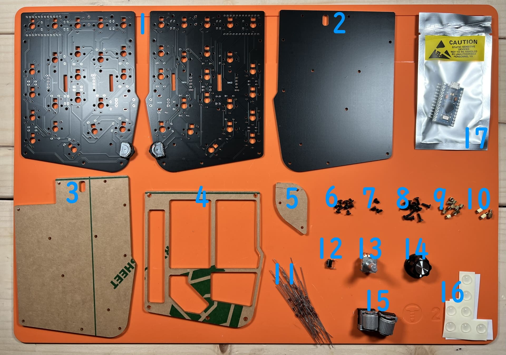
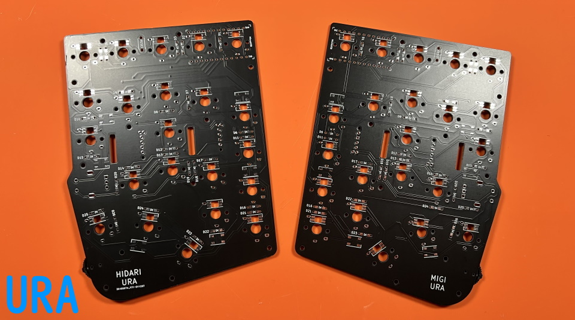

# Handyman マクロパッド ビルドガイド（[English](https://github.com/Taro-Hayashi/Handyman/blob/main/README_EN.md)）
- [キット内容](#キット内容)
- [準備](#準備)
- [はんだ付け](#はんだ付け画像を反転する)
- [組み立て](#組み立て)
- [カスタマイズ](#カスタマイズ)
- [おまけ](#おまけ)

## キット内容

||部品名|数| |
|-|-|-|-|
|1|メインボード左手用、右手用|1～2|遊舎工房のキットには両手分が入っています。|
|2|ミドルプレート1|1|透明アクリル・穴の開いている方|
|3|ミドルプレート2|1|透明アクリル|
|4|ボトムプレート|1|黒・PCB|
|5|保護プレート|1|透明アクリル・小さい|
|6|ネジ（短）|9|3mm|
|7|ネジ（中）|3|5mm|
|8|ネジ（長）|12|6mm|
|9|スペーサー（短）|12|3mm メス-メス|
|10|スペーサー（中）|3|4mm メス-オス|
|11|ダイオード|26|1N4148|
|12|リセットスイッチ|1||
|13|ロータリーエンコーダ（水平型）|1|EC11互換品|
|14|ノブ|1||
|15|ロータリーエンコーダ（ホイール）|2|EVQWGD001|
|16|ゴム足|7||
|17|Pro Micro|1|BOOTHではPro Microなし版を販売しています。|
|18|レバースイッチ|2|メインボードに取り付け済み。|

### キット以外に必要なもの
|部品名|数|||
|-|-|-|-|
|キースイッチ|22|Kailhロープロファイル（V1, V2)|V1：[遊舎工房](https://shop.yushakobo.jp/collections/all-switches/products/pg1350)、[Daily Craft Keyboard](https://shop.dailycraft.jp/collections/choc-switches)、V2：[遊舎工房](https://shop.yushakobo.jp/collections/all-switches/products/kailh-choc-v2)|
|キーキャップ|22|V1は専用、V2はCherryMXです。||
|Micro USB ケーブル|1||[遊舎工房](https://shop.yushakobo.jp/products/usb-cable-micro-b-0-8m)、[TALPKEYBOARD](https://talpkeyboard.net/items/5df82904a551d528d7360c34)、[Daily Craft Keyboard](https://shop.dailycraft.jp/products/usb_cable)|

### オプション
|部品名|数|||
|-|-|-|-|
|コンスルー 12ピン（高さ2.5mm）|2|[使い方](conthrough.md)|[遊舎工房](https://shop.yushakobo.jp/products/31?_pos=1&_sid=ca92edae3&_ss=r&variant=37665714405537)、[TALPKEYBOARD](https://talpkeyboard.net/items/5e056626d790db16e2889233)、[Daily Craft Keyboard](https://shop.dailycraft.jp/products/conthrough)|
|バックライトLED（SK6812MINI-E）|22|バックライト用|[遊舎工房](https://shop.yushakobo.jp/products/sk6812mini-e-10)、[秋月電子通商](https://akizukidenshi.com/catalog/g/gI-15478/)|
|アンダーグローLED（WS2812B）|6|アンダーグロー用|[遊舎工房](https://shop.yushakobo.jp/products/a0800ws-01-10)、[秋月電子通商](https://akizukidenshi.com/catalog/g/gI-07915/)|
|表面実装タイプのダイオード（1N4148W）|22||[遊舎工房](https://shop.yushakobo.jp/products/a0800di-02-100)、[Daily Craft Keyboard](https://shop.dailycraft.jp/products/diode_smd)、[秋月電子通商](https://akizukidenshi.com/catalog/g/gI-07084/)|

### 必要な工具
100円ショップで売っているもので十分ですが、はんだごては500円商品なので同程度の価格のFX511-01がおすすめです。
|工具名|Amazon|
|-|-|
|はんだごて|[FX511-01](https://amzn.to/3IEGO5w)、[FX600-02](https://amzn.to/3oKNQOg)||
|こて先クリーナー（こて台）|[FH300-81](https://amzn.to/3yuB3CV)、[599B-01](https://amzn.to/3DFsZjD)|
|鉛入りはんだ|[FS407-01](https://amzn.to/31S71fO)|
|精密ドライバー|[TSD-6](https://amzn.to/3dEQvm7)|
|ニッパー等ダイオードの足を切れるもの|[エコー金属 鍛造ニッパー](https://amzn.to/31S75fU)|
|マスキングテープ|[3M マスキングテープ 8巻パック](https://amzn.to/31G4Qwt)|
|エポシキ接着剤|[ボンド ハイスピードエポ](https://amzn.to/3FmPPhB)|
|Microsoft Edge、もしくはGoogle Chrome||

### あると便利な工具
|工具名||Amazon|
|-|-|-|
|耐熱シリコンマット||[ノーブランド](https://amzn.to/3rYlcuW)|
|温度調節可能なはんだごて|★|[FX600-02](https://amzn.to/3oKNQOg)||
|斜めに切ったタイプのこて先|★|[FX600用 T18-C2](https://amzn.to/3pGqbNW)|
|フラックス|★|[HAKKO 001-01](https://amzn.to/3dNy4vr)|
|フラックスリムーバー、IPA|★|[GZ901](https://amzn.to/3yeiMtj)|
|ピンセット|★|[ANEX ピンセット No.126](https://amzn.to/3GxKNPp)|
|耐熱絶縁テープ（カプトンテープ）|★|[秋月電子通商](https://akizukidenshi.com/catalog/g/gT-09378/)、[Amazon](https://amzn.to/3yzlEko)|
|テスター||[TDX-200](https://amzn.to/3rXlaDI)|
|はんだ吸い取り線||[FR150-88](https://amzn.to/3pPWWZ5)|
|はんだ吸い取り器||[DS01P](https://amzn.to/31RlusN)|

## 準備
左右どちらで作るかを選びます。  
  

キットに付属のPro MicroはMicro-USB端子がもげやすいのでエポシキ接着剤で補強します。  
  
両サイドと手前側のはんだ付けされてるところに少し厚めに塗ります。端子の中に入り込まないように気を付けます。
  
コンスルーを使う場合や黒い基板のPro Microを使う場合は必須の工程ではありません。  
乾燥させている間にはんだ付けを進めましょう。  

## はんだ付け
はんだ付けのやり方は動画で見るとわかりやすいです。  
パーツは思ったより壊れないので落ち着いて作業すると失敗しにくいです。  
 - ホームセンターのDCMさんの解説動画(58秒～)  [YouTube](https://www.youtube.com/watch?v=JFQg_ObITYE&t=58s)
### LEDのはんだ付け

LEDを取り付ける場合はメインボードに最初にはんだ付けします。  
 - [LEDの取り付け方](led.md)  
### ダイオード、リセットスイッチのはんだ付け
D1からD26まで取り付けます。  
足を曲げて裏から差し込みます。  
  
ダイオードには向きがあります。三角形の先の棒と黒線を合わせましょう。  

表で更に足を曲げて抜けないようにします。  
  
ダイオードと並行に曲げるとあとでキースイッチに干渉しにくいです。

はんだ付けをして足を切ります。  
   

リセットスイッチを裏から差し込み表ではんだ付けします。  
   
フラックスクリーナーを使う人はここで表面を綺麗にしておきましょう。  
   

### キースイッチのはんだ付け

表から差し込みます。  
  
ここの二つのスイッチはPro Microと接触する可能性があるので、足を切ってからはんだ付けします。　　
  
choc V1スイッチの場合、足が一か所干渉するので短くカットしてください。　　
  
全てのスイッチをはんだ付けします。　　
  

### Pro Microのはんだ付け
[コンスルーを使う場合](conthrough.md)はこのステップは飛ばしてください。

隠れてしまうダイオードD1の方向が合っているか、キースイッチの足がはんだ付けされているかを再度確認してください。  
Micro-USB端子がショートしやすいのでマスキングテープかカプトンテープで絶縁します。  
  
Pro Microに付属しているピンヘッダの、短い側を基板に差し込みます。  
  

Pro Microを乗せます。TX0, RAW, USBの位置をシルク印刷と合わせましょう。  
  
足をニッパーで切ったらはんだ付けします。  
  
  
基板側もはんだ付けします。  
  

## 動作テスト
ロータリーエンコーダーを取り付ける前にPro Microに動作ソフト（ファームウェア）を書き込んで動作確認をしましょう。  
キットとPCをUSBケーブルでつないでください。   

下のwebサイトにアクセスしてください。
- https://remap-keys.app/catalog/dTmFWd6gilf5ziDWE1TR/firmware

テストファームウェアを選んでFLASHします。
  
  

キットのリセットスイッチを押すとArduino Microが現れるので、クリックして接続します。
 

書き込みが完了したらウィンドウを閉じて大丈夫です。
 

アドレスバーやテキストエディタを使ってすべてのスイッチが反応することを確かめてください。  

### ロータリーエンコーダーのはんだ付け
SW12、SW14に表からホイール型のロータリーエンコーダーを取り付けます。  
ピンの位置を確認してツメを穴に差し込みます。  
  

ツメを穴に引っかけてからピンを穴に差し込みます。  
ピンを曲げてしまわないように注意してください。  
  

差し込めたらはんだ付けします。  
  

SW20に表から水平型のロータリーエンコーダーを取り付けて裏からはんだ付けします。  
  
ピンが曲がらないように気を付けましょう。  
  
クリップの部分ははんだ付けしなくても構いません。  
  

お疲れ様でした。再び動作を確認して問題がなければはんだ付けは終了です。

## 組み立て
USBケーブルを抜いてプレートを組付けます。  
アクリルからは保護フィルムを剥がしてください。割れやすいので気をつけましょう。  

  
メインボードの赤丸のネジ穴にスペーサー（中）とスペーサー（短）を止めます。  
画像のようにスイッチがついてる側にスペーサー（中）があるようにしてください。  
  

メインボード裏面の残りのネジ穴にスペーサー（短）をネジ（短）で取り付けてミドルプレート1（透明）を嵌めます。
  

ミドルプレート2とバックプレートをネジ（長）で止めます。
  
  
ゴム足も貼りました。

表に保護プレートをネジ（中）で取り付けましょう。
  

マイナスドライバーでノブを取りつけ、キーキャップを付けたら完成です。
  

先ほどと同様の手順で本番用のファームウェアに更新しましょう。
- https://remap-keys.app/catalog/dTmFWd6gilf5ziDWE1TR/firmware
  

## カスタマイズ
標準ではUS配列設定でのClip Studio Paintにあわせたキーマップになっています。  
  
[Keyboard Layout Editor で見る](http://www.keyboard-layout-editor.com/#/gists/b1de3d8b33b46ababd2dff071c8af257)  

使わないキーを削除したり使用頻度の高いキーを押しやすい位置に変更してみましょう。  

ChromeかEdgeでRemapにアクセスしてください。  
- Remap https://remap-keys.app/

  
左を選んで進んでいくとアドレスバーからメッセージが出てキーボードを選択できます。  

ドラッグアンドドロップで変更が終わったら右上のflashボタンを押すと反映されます。  
  

JIS配列、MacのUS配列用のキーマップ、普通のキーボードのようなキーマップを用意したのでよろしければ手間を省くのにご利用ください。

## その他
ファームウェアのフォルダ  
https://github.com/Taro-Hayashi/qmk_firmware/tree/master/keyboards/handyman

VIA用JSONファイル [handyman.json](https://github.com/Taro-Hayashi/Handyman/releases/download/14.19/handyman.json)  

プレートのデザインデータ  
[handyman_plates.zip](https://github.com/Taro-Hayashi/Handyman/releases/download/14.31/handyman_plates.zip)  
発注先のルールに沿ってデータを修正してください。  

ご不明な点があればBOOTHのメッセージかtwitterでいつでも聞いてください。   

foostan様のフットプリントを流用、改変して使わせていただきました。  
https://github.com/foostan/kbd/  
https://github.com/foostan/kbd/blob/master/LICENSE  

plut0nium様のフットプリントを流用、改変して使わせていただきました。  
https://github.com/plut0nium/0xLib  
https://github.com/plut0nium/0xLib/blob/master/LICENSE.txt  

 この キット は <a rel="license" href="http://creativecommons.org/licenses/by-sa/4.0/">クリエイティブ・コモンズ 表示 - 継承 4.0 国際 ライセンス</a>の下に提供されています。

- 遊舎工房: https://shop.yushakobo.jp/collections/keyboard/products/2795   
- BOOTH: https://tarohayashi.booth.pm/items/3208122
