# Handyman マクロパッド Build Manual（[日本語](https://github.com/Taro-Hayashi/Handyman/blob/main/README.md)）
- [Contents](#Contents)
- [Soldering](#Soldering)
- [Testing](#Testing)
- [Assembling](#Assembling)
- [Customise](#Customise)

## Contents
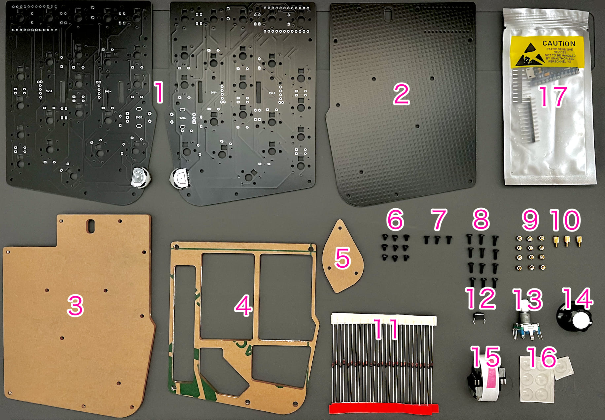
||Name|Quantities| |
|-|-|-|-|
|1|Main board|1||
|2|Middle plate #1|1||
|3|Middle plate #2|1||
|4|Bottom plate|1||
|5|Cover plate|1||
|6|Short screws|9|3mm|
|7|Middle screws|3|4mm|
|8|Long screws|12|6mm|
|9|Short spacer|12|3mm|
|10|Middle spacer|3|4mm|
|11|Diodes|26|1N4148|
|12|Tactile Switch|1||
|13|Dial rotary encoder|1|EC11|
|14|Knob|1||
|15|Wheel rotary encoder|2|EVQWGD001|
|16|Rubber feet|7||
|17|Pro Micro|1||
|18|Lever switch|1|Assembled|

## Additional required
|Name|Quantities||
|-|-|-|
|Switches|22|Kailh Low Profile Switches V1/V2|
|Keycaps|22|1U|
|Micro-USB Cable|1|[Yushakobo](https://shop.yushakobo.jp/en/products/usb-cable-micro-b-0-8m)|

## Optional
|Name|Quantities|||
|-|-|-|-|
|Conthrough|2|[Usage](conthrough_EN.md)|[Yushakobo](https://shop.yushakobo.jp/products/31?_pos=1&_sid=ca92edae3&_ss=r&variant=37665714405537)|
|SK6812MINI-E|9|[Usage](led_EN.md)|[Yushakobo](https://shop.yushakobo.jp/en/products/sk6812mini-e-10)|
|WS2812B|3||[Yushakobo](https://shop.yushakobo.jp/en/products/a0800ws-01-10)|

## Soldering
Install the diodes from D1 to D26.  
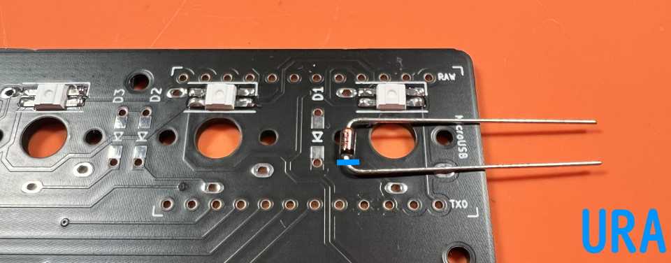  
Diodes have a direction.  

Bend the legs parallel to the diode to prevent interference with the key switch later.  
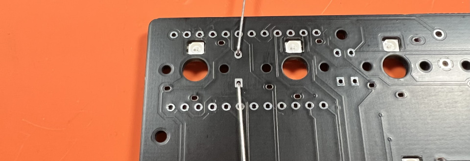  

Solder and cut the legs.  
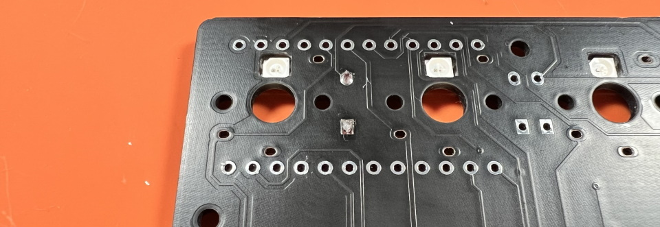   

Solder Tactile Switches.  
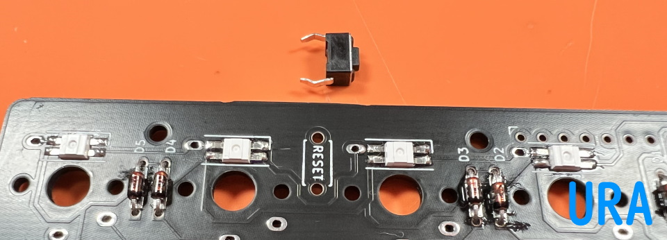   
If you want to remove the flux from the surface, now is the time.  
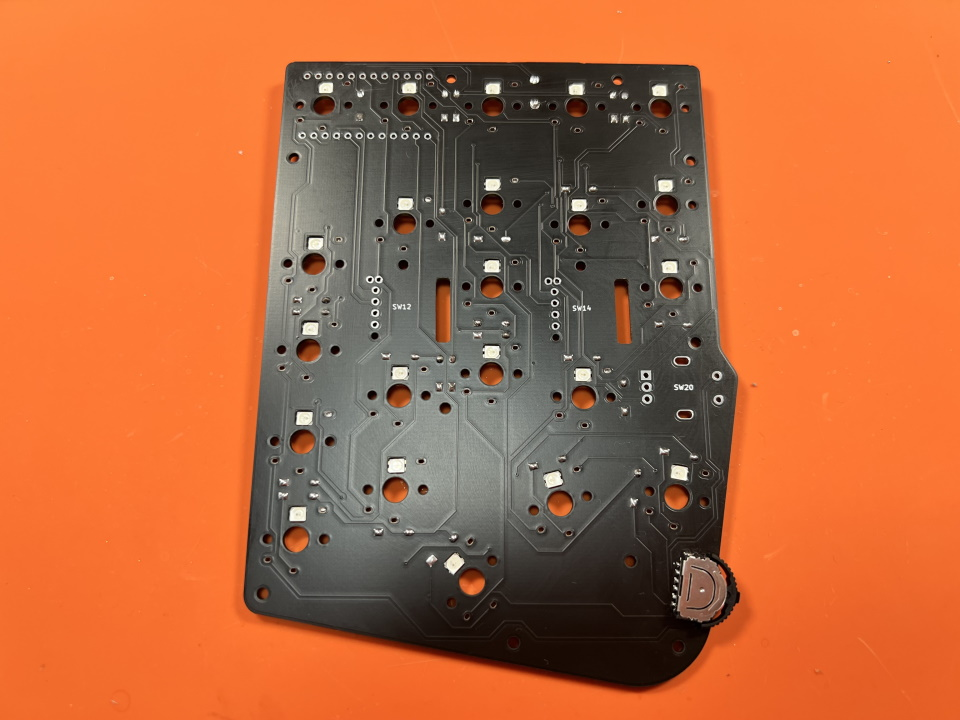   

Solder Switches.  
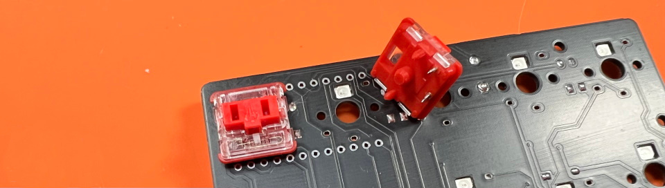  
The two switches here may come in contact with the Pro Micro, so cut off the legs before soldering.  
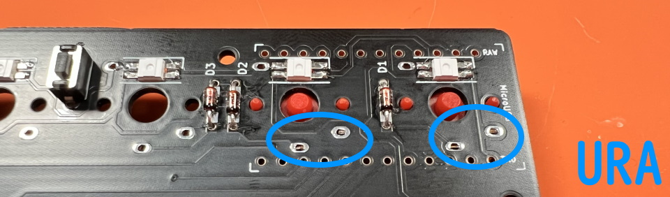  
In the case of the choc V1 switch, one of the legs will interfere with the switch, so cut it short.  
  

Insulate the USB terminal of the Promicro where it is shorted.  
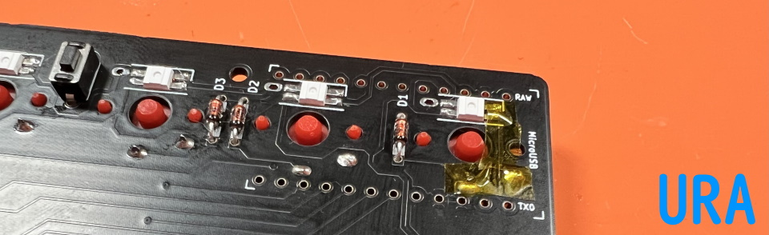   

Plug the short end of the pin header into the board.  
   

Place the Pro Micro and cut off the pins.  
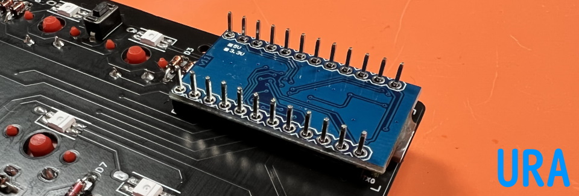   
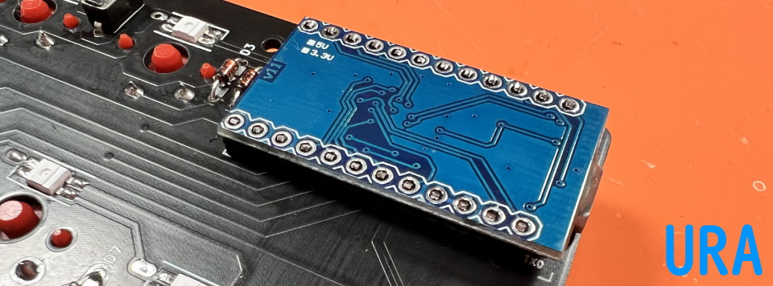   

Solder Pro Micro.  
   
Solder the front side.
   

Solder rotary encoders.  
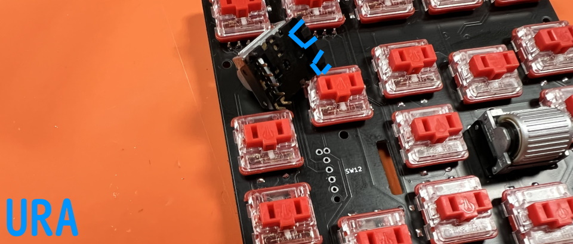  
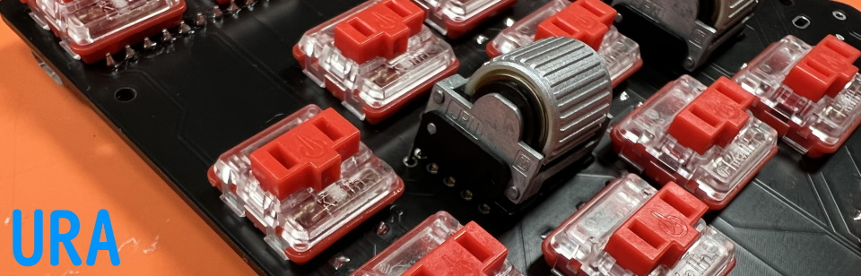  
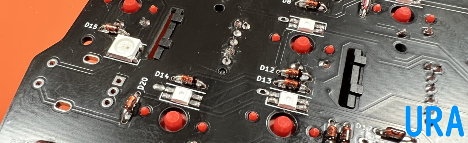  
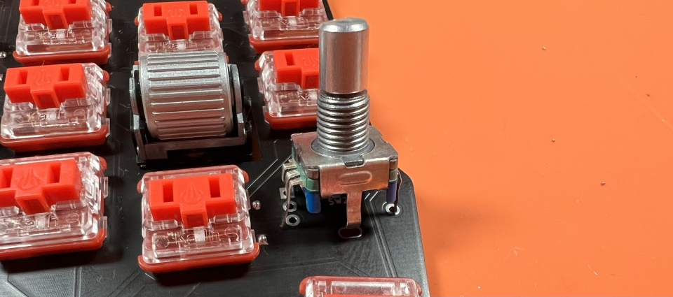  
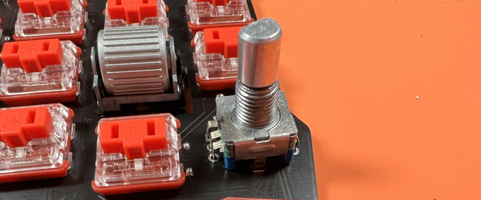  
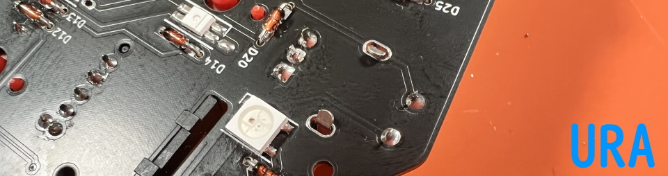  

## Testing
Connect one of them to the PC with a USB cable.  
Access Remap's firmware page with Chrome or Edge.  
- https://remap-keys.app/catalog/dTmFWd6gilf5ziDWE1TR/firmware

Flash the Test firmware.  
  
  

Push the tactile switch.  
 
 

Make sure all switches are responsive.  
If there are no problems, soldering is finished.  

## Assembling
Disconnect the USB cable. 

Attach the short and middle spacers to the red circle.  
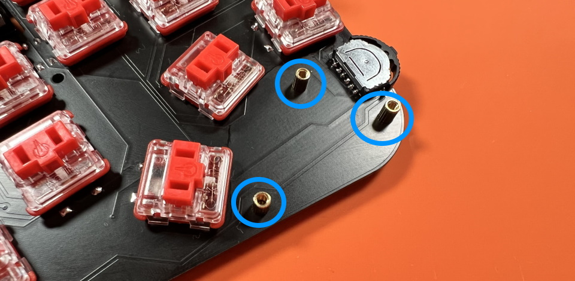  
There will be middle spacers on the side of the key switch.  
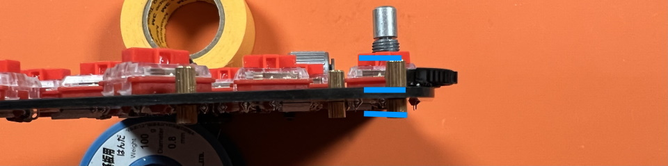  

Attach short spacers on the back of the main board with short screws.  
And fit the middle plate #1.  
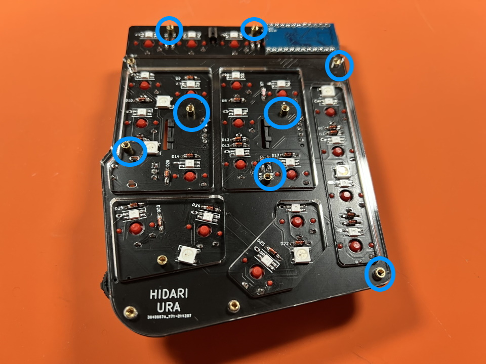  

Fasten the middle plate #2 and the back plate with long screws.  
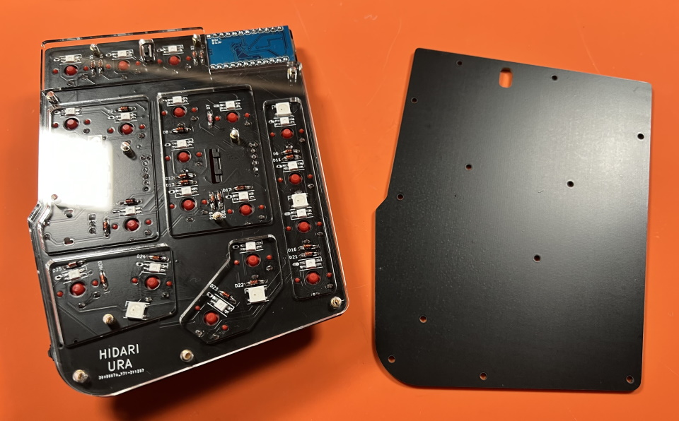  
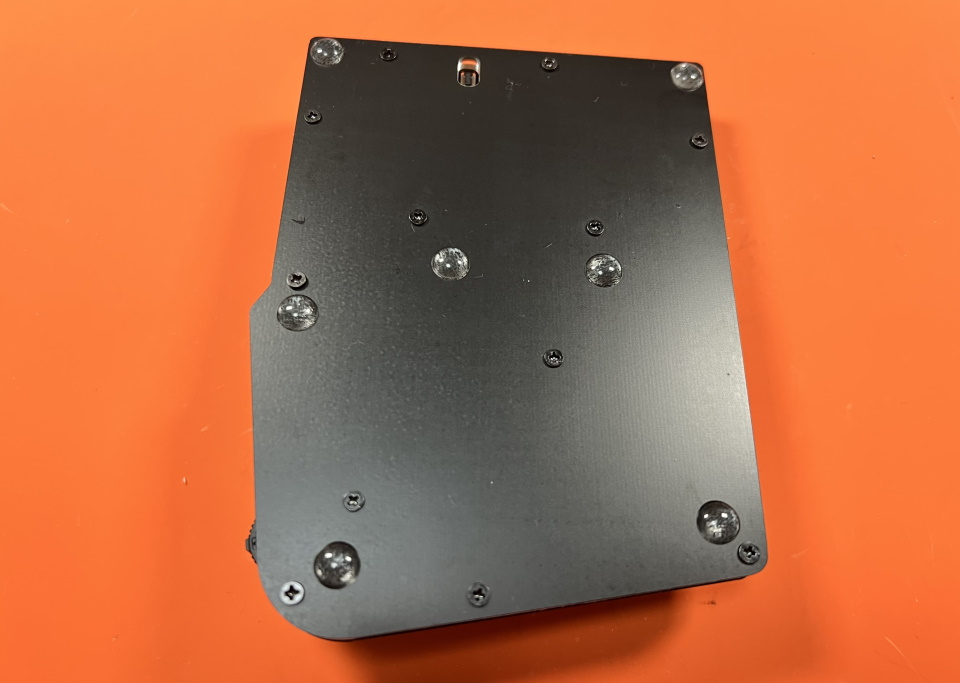  

Attach cover plate to the front with middle screws.  
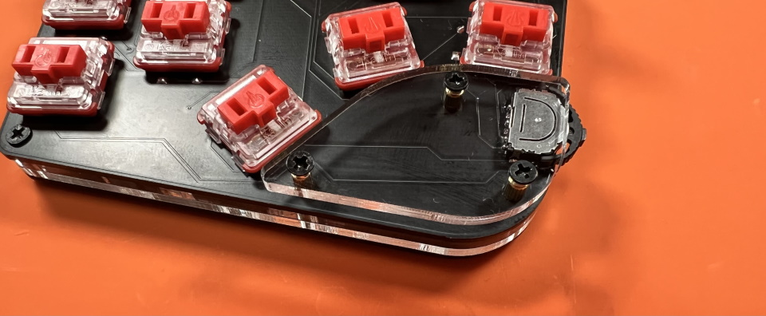  

After installing the keycap, follow the same procedure as before to update the firmware for production.  
- https://remap-keys.app/catalog/dTmFWd6gilf5ziDWE1TR/firmware
  

Attaching the knob and rubber feet.  
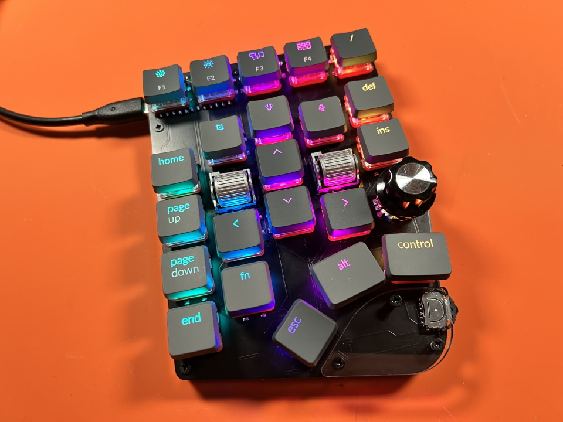  

Thank you for your time.  

## Customise
  
[Keyboard Layout Editor](http://www.keyboard-layout-editor.com/#/gists/b1de3d8b33b46ababd2dff071c8af257)  

Access Remap.  
- Remap https://remap-keys.app/

Select the blue button on the left to proceed.  
  

After Drag-and-Drop the keys, press the flash button in the upper right corner.  
  

## Misc
Firmware  
https://github.com/Taro-Hayashi/qmk_firmware/tree/master/keyboards/handyman

JSON for Remap/VIA  
[handyman.json](https://github.com/Taro-Hayashi/Handyman/releases/download/14.19/handyman.json)  

Plates data   
[handyman_plates.zip](https://github.com/Taro-Hayashi/Handyman/releases/download/14.31/handyman_plates.zip)  

Used foostan's footprint.  
https://github.com/foostan/kbd/  
https://github.com/foostan/kbd/blob/master/LICENSE  

Used plut0nium's footprint.  
https://github.com/plut0nium/0xLib  
https://github.com/plut0nium/0xLib/blob/master/LICENSE.txt  

 

- Yushakobo: https://shop.yushakobo.jp/en/products/2795  
- BOOTH: https://tarohayashi.booth.pm/items/3208122
