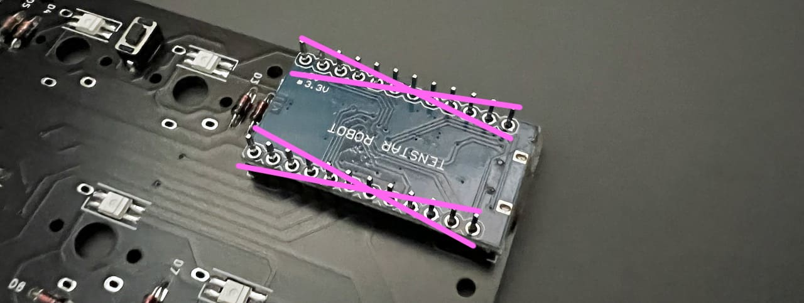
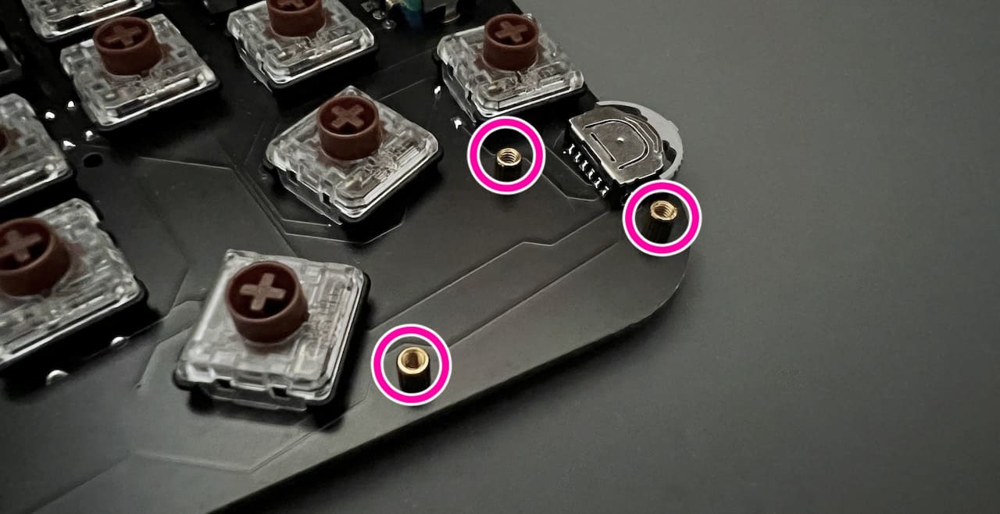
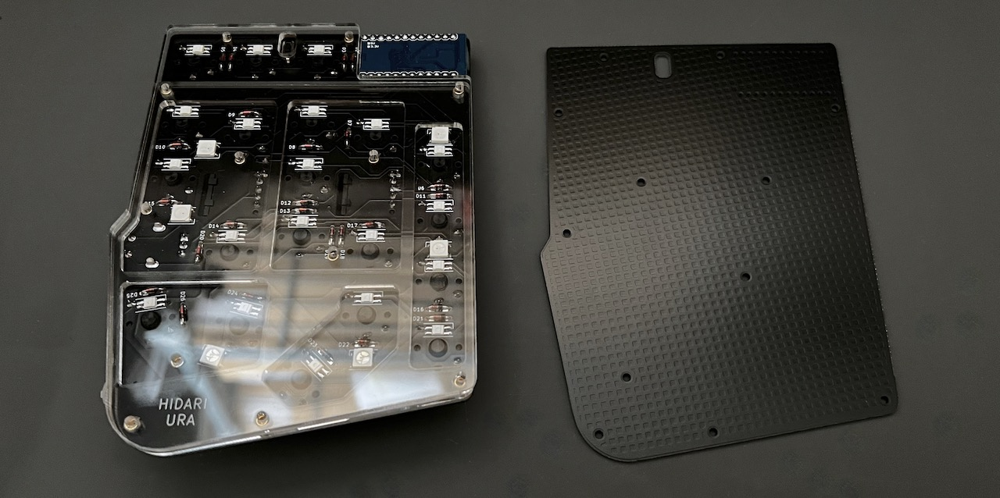

# Handyman マクロパッド Build Manual（[日本語](https://github.com/Taro-Hayashi/Handyman/blob/main/README.md)）
- [Contents](#Contents)
- [Soldering](#Soldering)
- [Testing](#Testing)
- [Assembling](#Assembling)
- [Customise](#Customise)

## Contents

||Name|Quantities| |
|-|-|-|-|
|1|Main board|1||
|2|Middle plate #1|1||
|3|Middle plate #2|1||
|4|Bottom plate|1||
|5|Cover plate|1||
|6|Short screws|9|3mm|
|7|Middle screws|3|4mm|
|8|Long screws|12|6mm|
|9|Short spacers|12|3mm|
|10|Middle spacers|3|4mm|
|11|Diodes|26|1N4148|
|12|Tactile Switch|1||
|13|Dial rotary encoder|1|EC11|
|14|Knob|1||
|15|Wheel rotary encoder|2|EVQWGD001|
|16|Rubber feet|7||
|17|Pro Micro|1||
|18|Lever switch|1|Assembled|

## Additional required
|Name|Quantities||
|-|-|-|
|Switches|22|Kailh Low Profile Switches V1/V2|
|Keycaps|22|1U|
|Micro-USB Cable|1|[Yushakobo](https://shop.yushakobo.jp/en/products/usb-cable-micro-b-0-8m)|

## Optional
|Name|Quantities|||
|-|-|-|-|
|Conthrough|2|[Usage](conthrough_EN.md)|[Yushakobo](https://shop.yushakobo.jp/products/31?_pos=1&_sid=ca92edae3&_ss=r&variant=37665714405537)|
|SK6812MINI-E|9|[Usage](led_EN.md)|[Yushakobo](https://shop.yushakobo.jp/en/products/sk6812mini-e-10)|
|WS2812B|3||[Yushakobo](https://shop.yushakobo.jp/en/products/a0800ws-01-10)|

## Soldering
Install the diodes from D1 to D26.  
  
Diodes have a direction.  

Bend the legs parallel to the diode to prevent interference with the key switch later.  
  

Solder and cut the legs.  
  

Solder Tactile Switches.  
  
If you want to remove the flux from the surface, now is the time.  
   

Insert the short side of the pin header into the Pro Micro mounting location.  
  
Place Pro Micro on top, but do not solder it. Leave it on the front.  
 
  
Solder pin headers to the main board.  
  

The two keyswitches here are cut short because their feet interfere with the Pro Micro.  
  
Cut it short while it is inserted.  
  
For Choc V2, shorten three legs; for Choc V1, shorten two legs and one of the fixing supplies.  
  
  
Solder all switches.　
  

Insulate the Micro-USB terminals with Kapton tape or masking tape, as they are prone to short circuits. 
  
After cutting the legs, solder them.  
  
  

Solder rotary encoders.  
   
   
  
  

## Testing
Connect one of them to the PC with a USB cable.  
Access Remap's firmware page with Chrome or Edge.  
- https://remap-keys.app/catalog/dTmFWd6gilf5ziDWE1TR/firmware

Flash the Test firmware.  
  
  

Push the tactile switch.  
 
 

Make sure all switches are responsive.  
If there are no problems, soldering is finished.  

## Assembling
Disconnect the USB cable. 

Attach short spacers on the back of the main board with short screws.  
And fit the middle plate #1.  
   
The three places here on the front side are not held in place by screws, but by middle spacers.
 

Fasten the middle plate #2 and the back plate with long screws.  
 
Put rubber feet.
  

Attach cover plate to the front with middle screws.  
  

After installing the keycap, follow the same procedure as before to update the firmware for production.  
- https://remap-keys.app/catalog/dTmFWd6gilf5ziDWE1TR/firmware

  

Attaching the knob and keycaps.  
  

Thank you for your time.  

## Customise
  

Access Remap.  
- Remap https://remap-keys.app/

Select the blue button on the left to proceed.  
  

After Drag-and-Drop the keys, press the flash button in the upper right corner.  
  

## Misc
Firmware  
https://github.com/Taro-Hayashi/qmk_firmware/tree/master/keyboards/handyman

JSON for Remap/VIA  
[handyman.json](https://github.com/Taro-Hayashi/Handyman/releases/latest/download/handyman.json)  

Plates data   
[handyman_plates.zip](https://github.com/Taro-Hayashi/Handyman/releases/latest/download/handyman_plates.zip)  

Used foostan's footprint.  
https://github.com/foostan/kbd/  
https://github.com/foostan/kbd/blob/master/LICENSE  

Used plut0nium's footprint.  
https://github.com/plut0nium/0xLib  
https://github.com/plut0nium/0xLib/blob/master/LICENSE.txt  

 

- Yushakobo: https://shop.yushakobo.jp/en/products/2795  
- BOOTH: https://tarohayashi.booth.pm/items/3208122
