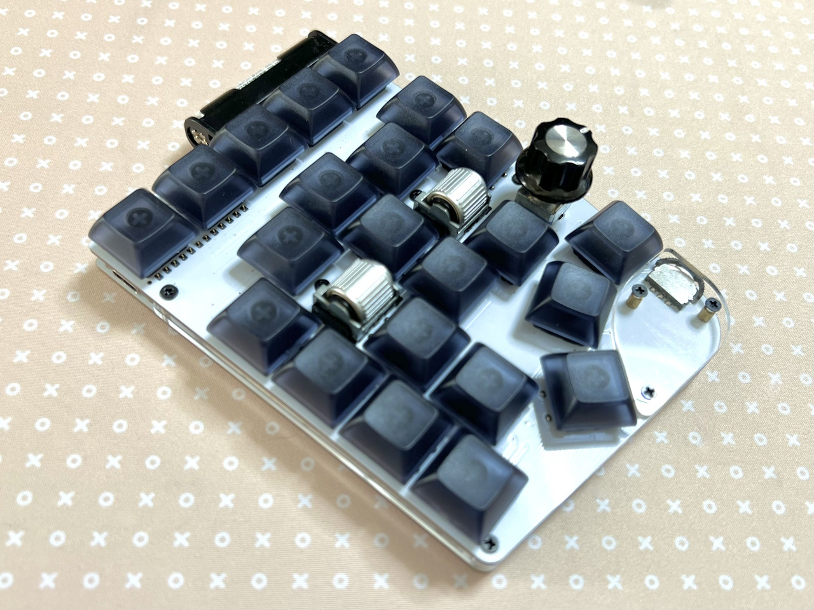

# 電池ボックスの使い方

> [!WARNING] 
> 現在はBOOTHで販売中の基板のみ対応しています。

## 用意するもの
|||
|-|-|
|[ピンヘッダー](https://akizukidenshi.com/catalog/g/g100167/)|合計26ピン以上|
|[シングルピンソケット (低メス) ](https://akizukidenshi.com/catalog/g/g100661/)|合計26ピン以上（リンク先なら2個）|
|[電池ボックス 単4](https://akizukidenshi.com/catalog/g/g102670/)|1|
|[XCL103使用3.3V出力昇圧DCDCコンバーターキット](https://akizukidenshi.com/catalog/g/g116116/)|1|
|[スライドスイッチ](https://akizukidenshi.com/catalog/g/g113989/)|1|
|[BLE Micro Pro](https://shop.yushakobo.jp/products/ble-micro-pro)|1|

[!WARNING]
BLE Micro Proの使い方や組み立て方は各製品のものをご覧ください。

## 組み立て
   

