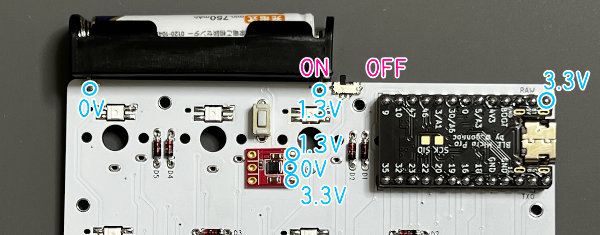

# 電池ボックスの使い方

## 用意するもの
> [!IMPORTANT] 
> 現在電池ボックスの取り付けに対応しているのはBOOTHで販売中のキットのみです。
> はんだ付けが難しめです。

|部品（購入先の例）|個数|
|-|-|
|[ピンヘッダー](https://akizukidenshi.com/catalog/g/g100167/)|合計26ピン以上|
|[シングルピンソケット (低メス) ](https://akizukidenshi.com/catalog/g/g100661/)|合計26ピン以上（リンク先なら2個）|
|[電池ボックス 単4](https://akizukidenshi.com/catalog/g/g102670/)|1|
|[XCL103使用3.3V出力昇圧DCDCコンバーターキット](https://akizukidenshi.com/catalog/g/g116116/)|1|
|[スライドスイッチ](https://akizukidenshi.com/catalog/g/g113989/)|1|
|[BLE Micro Pro](https://shop.yushakobo.jp/products/ble-micro-pro)|1|

> [!NOTE]
> BLE Micro Proの使い方は製品のサイトをご覧ください。

## 組み立て
スライドスイッチを取り付ける場所に予備はんだを盛ります。

スライドスイッチをはんだ付けします。

ダイオードやピンヘッダの足の切れ端をDCDCコンバーター用のパッドに立てるようにはんだ付けします。

I、G、Oの位置に注意してDCDCコンバーターをはんだ付けします。

> [!NOTE]
> 出来るだけ全高が低くなるようにはんだ付けしてください。

BLE Micro Proにピンソケットをのせ、ピンヘッダを差し込みます。

> [!WARNING]
> 上下に気を付けてください。

メインボードに差し込み表裏共にはんだ付けします。
> [!NOTE]
> 2か所はんだ付けが不要なホールがあります。

電池ボックスのピンを曲げて差し込みます。

> [!WARNING]
> ＋－に気を付けてください。

両面をはんだ付けします。

電池を入れてスライドスイッチを電池ボックス側に倒すと電源が入ります。
電圧は画像のようになるのでテスターでチェックする時は参考にしてください。

