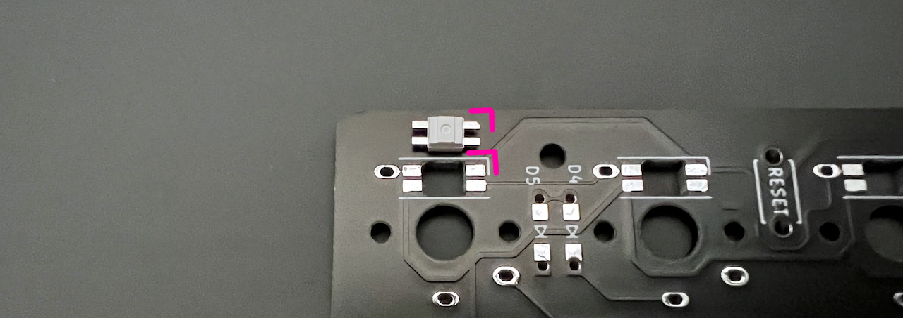

## LEDの取り付け方
端子同士がくっつきやすいので、LEDのはんだ付けにはフラックスを使います。  
はんだ付けの難易度がとても下がるため私はLED以外にも毎回使っています。  
ベタつくのでフラックスクリーナーやIPA（イソプロピルアルコール）で掃除をすると綺麗になります。  
  
LEDの切り欠きとシルク印刷のコーナーを合わせてはんだ付けしましょう。  
    
  
向きがバラバラなので毎回確認してください。方向を間違えるとショートしてしまってキーボード自体が動きません。  
    
    
フラックスを塗り、こて先にのせたはんだを流し込むようにするとスムーズに付けられます。  
    
両側のランドにはんだを乗せやすいようにLEDは中央に置くことを意識するといいと思います。  

SK6812MINI-Eは表面から見て方向が合っているか確認します。
  

ブラウザの機能で戻ってください。
